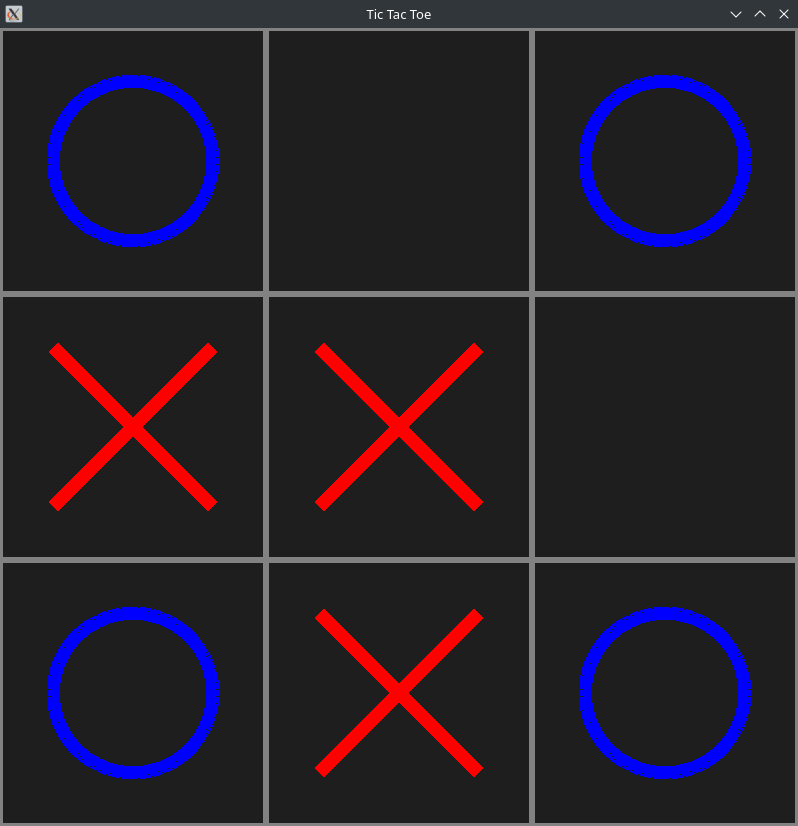

# Zig Zag Zoe

Inspired by [tsoding](https://www.youtube.com/watch?v=gCVMkKgs3uQ), this repository contains an implementation of Tic Tac Toe using [Zig](https://ziglang.org/) and [SDL3](https://wiki.libsdl.org/SDL3/FrontPage).

## Preview



## Building

> Note that the build is configured for x86_64 only

The project was implemented using zig 0.13.0 and libSDL3.so.0.1.7. The SDL wrapper is configured to use `vulkan` for rendering, it can be adjusted if necessary (see `src/sdl.zig`). As the time of this writing SDL3 has not been released yet and oftentimes must be built ["The Unix Way"](https://wiki.libsdl.org/SDL3/Installation). The repository includes an SDL submodule that will be built together with the binary.

To build the project run the following command:

```sh
make app
```

By default, the binary will be located at `.out/app/zig-zag-zoe`.

For the individual build commands check the `Makefile`.

### Flatpak

The `Makefile` contains a `flatpak` target which builds and bundles a flatpak file to `.out/dev.collet.ZigZagZoe` that can be installed on flatpak enabled environments.

To explore/debug the flatpak the following command can be used post-build:

```sh
flatpak-builder --run .out/flatpak-build/ flatpak/zig-zag-zoe.flatpak.yml sh
```

## License

See `License`.
